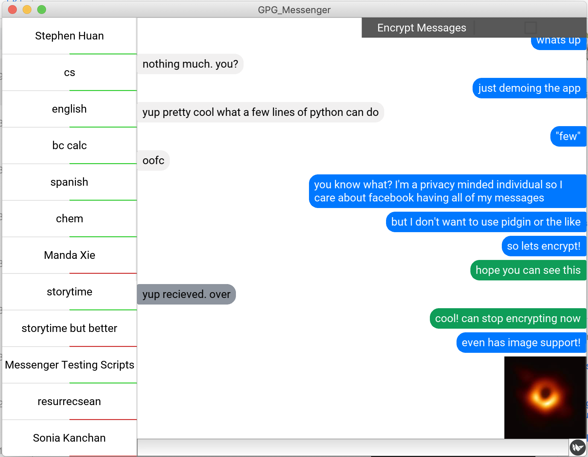
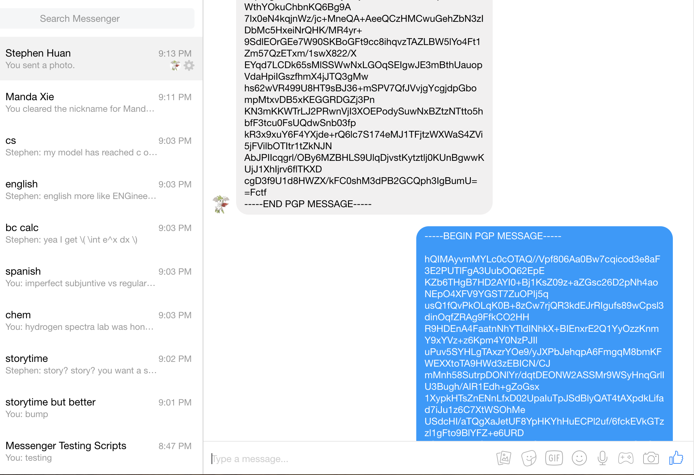

# GPG-Messenger
GnuPG (GPG) based messenger client that implements the openPGP encryption standard while using Facebook Messenger or an equivalent messaging platform as a backend. Very similar to [Pidgin](https://pidgin.im/) or [Adium](https://adium.im/).

Implemented using [**Python 3.7**](https://www.python.org/).

Libraries used: Check the Pipfile!

## In Action
From the app:
 

From Facebook Messenger:


## Setup

1. Run `pipenv install` in the directory which you downloaded this respository (henceforth known as the "root" path).
2. Two options - either create and gpg-encrypt a text file that contains your facebook password with:
```
$ echo "FACEBOOK_PASSWORD" | gpg --armor -r "YOUR_PUBLIC_KEY" -e > FILENAME
```
OR just type in your password when prompted later (won't be encrypted - not recommended)
3. Create an empty file called **config.json** with the path /accounts/facebook/config.json relative to root.
4. Navigate to the root directory and run `pipenv run python messenger.py edit facebook`
and follow the prompts.

5. Finally, launch the app with
```
$ pipenv run python3 app.py
```
